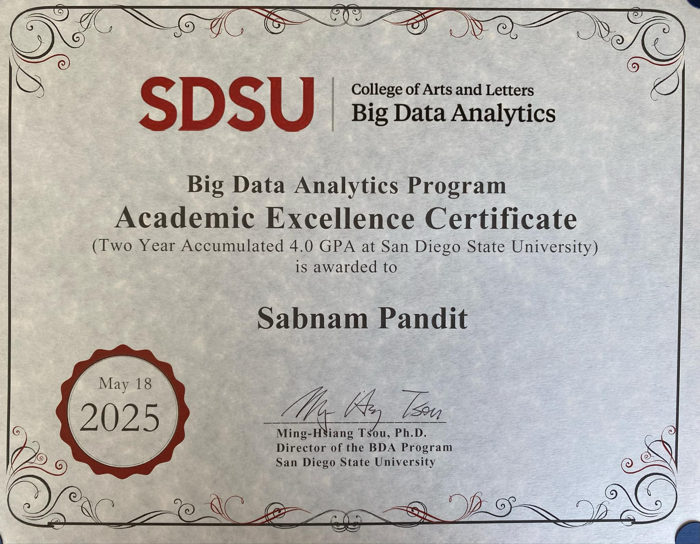

## 🎓 I Just Graduated! A Journey of Growth, Grit, and Gratitude

*Reflections from my Master’s in Big Data Analytics at San Diego State University*

---

### The Beginning: Excitement, Nervousness, and Determination

I just graduated with my Master’s in **Big Data Analytics** from SDSU! After months of hard work, late-night coding sessions, and unforgettable memories, I’m finally holding that diploma in my hands.  

I still remember opening my admission email — a mix of excitement, nervousness, and sheer determination. Orientation at **Storm Hall** was the official beginning. Meeting my cohort — brilliant minds from around the world — was overwhelming in the best way possible.  

> “By the end of this journey, I didn’t just earn a degree — I began shaping myself into a Data Scientist.”

From day one, I told myself: *“Give it your all.”* I had come to a new country, full of opportunities, determined to make the most of it.

---

### 💻 Experiences That Shaped Me

##### My First Project: Image Caption Generation with Custom Music Recommendation

I was a complete beginner, learning, stumbling, and doubting myself — but the joy of finally seeing it work was unforgettable.

Starting with Neural Networks, CNN models, TensorFlow, and Keras for our project was a steep learning curve. Everything was new and challenging: exploring concepts, watching tutorials, and figuring things out through self-learning. The effort to resolve bugs and celebrate small milestones along the way gave me a real taste for doing more and learning more.

When the model finally ran, a mix of relief, triumph, and confidence washed over me, a true “bring it on” feeling. This project pushed me well beyond my comfort zone, but I genuinely enjoyed every bit of it. Challenging yourself with something new and committing to learning it is incredibly rewarding. When you finally make something work that was once beyond your reach, that feeling is truly empowering.

---

#### Research with San Diego Zoo

Working with my professor on a project in collaboration with the **San Diego Zoo Safari Park** was surreal. Driving to the park to present our findings gave me my first taste of academic research and boosted my confidence to share work publicly.  

  

---

#### GMIS Conference Experience

Attending **GMIS (Great Minds in STEM)** was inspiring, filled with knowledge, networking, and a glimpse into what’s possible. When I received an email from a professor informing me that I had the chance to attend a conference with a CASHI travel scholarship, it felt surreal.  

---

#### Teaching Assistant

Being a Teaching Assistant for **Advanced Programming Languages** was terrifying at first, but every week I gained more confidence. Proctoring an in-person exam for 65 students on my own was a small victory that whispered, *“Hey, maybe you could teach someday.”*  

I also served as a grading assistant for the **Principles and Techniques in Data Science** course. It was a learning experience for me as well, as I gained new perspectives and ideas from the students. Our professor was incredibly supportive, and this experience taught me to be responsible, hardworking, and humble.

---

### 🔄 Lessons I’d Share With My Past Self

While I’m proud of my journey, there are a few things I’d approach differently:

-  **It’s not just about the course — it’s about the professor.**  
  Research teaching styles and past student experiences; mentorship matters.

-  **Take a class from a professor you admire.**  
  Don’t wait. Reach out early and find ways to collaborate.

-  **Start preparing for internships immediately.**  
  Resume, cover letters, LinkedIn — start early. Timing can make all the difference.

-  **Ask for help and take risks.**  
  Growth comes from stepping out of your comfort zone.

---

## 🏅 BDA Excellence Award & What’s Next

  

I’m thrilled to share that I graduated with a **4.0 GPA** and received the **BDA Excellence Award**, a proud moment symbolizing all the effort, perseverance, and growth over the past two years.  

Now, I’m ready to dive into the real world, eager to apply my skills, discover new ones, and explore the full extent of my potential. The learning doesn’t stop here. I’m on it. 💪  

---

## ✨ Reflections

Two years ago, I was nervous about stepping into a new country, a new educational system, and an entirely new field. Today, I’m grateful for the challenges, the failures, the late nights, the mentors, and the friends who made this journey unforgettable.  

> *“Embrace every moment. The struggles, the excitement, the tiny wins — they all shape you in ways you’ll only realize later.”*

To anyone reading this who’s about to embark on a similar path: keep learning, stay curious, and trust the process.
